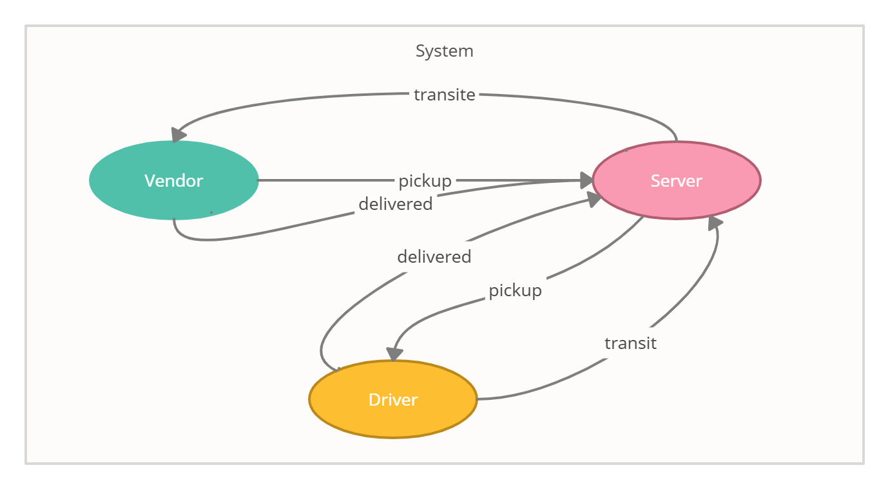

# caps
* CAPS Phase 1: Begin the build of an application for a company called CAPS - The Code Academy Parcel Service. In this sprint, we’ll build out a system that emulates a real world supply chain. CAPS will simulate a delivery service where vendors (such a flower shops) will ship products using our delivery service and when our drivers deliver them, be notified that their customers received what they purchased.

# Author: Reem Alqurm
# GitHub repository:
* [link](https://github.com/reem-alqurm/caps)

# PR link : 
* [link](https://github.com/reem-alqurm/caps/pulls)

# GitHub actions:
* [link](https://github.com/reem-alqurm/caps/actions)

# The Setup
## How to install
* Clone down repository from GitHub
* Run the command npm install to install dependencies (dotenv,faker, jest)
* Run the command npm install within server to install all dependencies 
* Run the command npm install within driver, and vendor folders to install all dependencies
* create .env file with a **storename**.
## How to test
* Run the command npm test to test

## UML 

